# Nestbrain Research Pipeline

 <!-- Assuming this exists based on the installer docs -->

Nestbrain is a powerful Python and PyQt6-based desktop application designed to supercharge your research workflow. It orchestrates a sophisticated pipeline that automatically converts your Zotero collections into highly structured, synthesized Markdown knowledge notes, classifies them into a local vault taxonomy, and visualizes the connections in an interactive knowledge graph.

By leveraging local and cloud LLMs (via NVIDIA NIM and Ollama) alongside native NotebookLM integrations, Nestbrain automates the heavy lifting of literature review, entity extraction, and concept synthesis.

---

## 🌟 Core Features

* **Desktop-First Orchestration**: A responsive PyQt6 UI (`nestbrain/ui/main_window.py`) that manages complex pipelines via background worker threads.
* **Automated Research Pipeline**:
  * **Ingestion**: Native integration with Zotero to sync collections and items, and automated source ingestion into Google's NotebookLM.
  * **Planning & Q&A**: Generates a dynamic taxonomy of research questions and executes an iterative Q&A loop against NotebookLM.
  * **Synthesis & Extraction**: Synthesizes answers into master notes and extracts key entities using high-confidence LLM passes.
  * **Seeding & Annotation**: Automatically seeds new concept notes, deduplicates entities, and weaves inline wikilinks to connect ideas.
* **Intelligent Vault Management**: Automatically classifies, formats, and files synthesized Markdown notes into a structured taxonomy within your local vault.
* **Interactive Knowledge Graph**: Builds and renders a dynamic, semantic network visualization of your notes and their conceptual connections using NetworkX.
* **Flexible AI Backends**: Supports NVIDIA NIM for high-performance cloud inference and Ollama for local fallback, ensuring robust entity extraction, semantic auditing, and embedding indexing.

---

## 🏗️ Architecture & Pipeline

Nestbrain is built around a robust, stateful orchestration engine. The active runtime path flows from the user interface down to file-system persistence. 

### Full Pipeline Workflow

<details>
<summary>Click to expand the 20-stage pipeline breakdown</summary>

1. **Launch and Bootstrap**: UI initialized, vault and configs loaded or created.
2. **Pipeline Trigger**: User clicks start; a background `PipelineWorker` is spawned.
3. **Runner Validation**: Vault path validated; `Zotero`, `Ollama`, and `NVIDIA` clients initialized.
4. **Workflow Initialization**: Notes baseline parsed, Zotero collections synced.
5. **Registry Hydration**: Collection state retrieved from `pipeline-registry.json`.
6. **Notebook Provisioning**: A NotebookLM notebook is created if one doesn't exist.
7. **Source Ingestion**: New collection items are uploaded to NotebookLM.
8. **Layer 1 - Question Planning**: A dynamic taxonomy of research questions is generated via LLM.
9. **Layer 1 - Q&A Loop**: Deep, iterative research is executed against NotebookLM.
10. **Layer 1 - Master Synthesis**: Answers are synthesized into a coherent master note.
11. **Layer 2 - Entity Extraction**: High-confidence entities (concepts, organizations, people) are extracted.
12. **Layer 2 - Entity Seeding**: New concept notes are created or merged, deduplicating terms in real-time.
13. **Inline Link Weaving**: Entities in the master note are wrapped in `[[wikilinks]]` for connectivity.
14. **Note Writing & Filing**: The final note is rendered and placed into the correct taxonomic vault folder.
15. **Layer 3 - Propagation**: The new note is embedded, similar notes are found, and semantic connections are automatically annotated across the vault.
16. **Collection Persistence**: Pipeline registry is updated with the final filed path.
17. **Workflow Return**: Execution hands back control to the main runner.
18. **Graph Build & Archive**: A network graph payload is constructed, and a run archive snapshot is saved.
19. **UI Refresh**: The desktop interface updates the notes list and dynamic knowledge graph.
20. **Post-Run Review**: Artifacts (logs, audits, index) are fully persisted for inspection.

</details>

### Pipeline Blueprint

```mermaid
flowchart TD
    A[App Launch\nmain.py] --> B[ensure_config + init_vault + load_config]
    B --> C[MainWindow Ready]
    C --> D[User Starts Pipeline]
    D --> E[MainWindow._start_pipeline\nQThread + PipelineWorker]
    E --> F[PipelineWorker.run]
    F --> G[PipelineRunner.run/_run_async]
    G --> H{Vault Path Valid?}
    H -- No --> H1[Return Error Payload\nerrors.vault]
    H1 --> UIE[MainWindow._on_pipeline_error or vault dialog]
    H -- Yes --> I[Init ZoteroSyncClient + OllamaClient + GraphBuilder]
    I --> J[PipelineWorkflow.run_full_pipeline]
    J --> K[MarkdownNoteParser.parse_vault]
    K --> L[Init NoteSeeder + VectorIndexer + SemanticAuditor + ConnectionAnnotator]
    L --> M{Selected Collection Key?}
    M -- Yes --> N[zotero.sync_collections_by_keys]
    M -- No --> O[zotero.sync_all]
    N --> P[For Each Collection: process_collection]
    O --> P

    P --> Q[registry.get_or_create + get_new_sources]
    Q --> R{Notebook ID Exists?}
    R -- No --> R1[NotebookLMBridge.create_notebook\nregistry.set_notebook_id + save]
    R -- Yes --> S
    R1 --> S[Ingest New Sources]
    S --> S1{Any New Items?}
    S1 -- Yes --> S2[ingest_text loop\nregistry.mark_processed + save]
    S1 -- No --> T
    S2 --> T[QuestionPlanner.generate_taxonomy]
    T --> U[QAndALoop.execute_research]
    U --> V[MasterSynthesizer.synthesize]
    V --> W[EntityExtractor.extract_entities]
    W --> W1{Entities Found?}
    W1 -- No --> W2[Warning + skip seeding]
    W1 -- Yes --> X[NoteSeeder.process_extracted_term loop]
    X --> X1{Duplicate Match?}
    X1 -- Yes --> X2[merge_note existing]
    X1 -- No --> X3[_seed_new_note -> classify_and_file]
    X2 --> X4[append seeder_log.json]
    X3 --> X4
    W2 --> Y
    X4 --> Y[weave_inline_wikilinks + build SynthesisResult]

    Y --> Z[write_note]
    Z --> Z1{Existing Note Path?}
    Z1 -- Yes --> Z2[merge_into_existing_note + atomic replace]
    Z1 -- No --> Z3[render_master_note temp file]
    Z3 --> Z4[classify_and_file]
    Z4 --> Z5{Classification Success?}
    Z5 -- No --> Z6[log_classification_failure]
    Z5 -- Yes --> AA[Note Filed]
    Z2 --> AA
    Z6 --> AB[Return empty note_path warning]
    AA --> AC[_propagate_note]
    AC --> AD[VectorIndexer.embed_new_note\nupdate .nestbrain_index.json]
    AD --> AE[find_similar_notes]
    AE --> AF[SemanticAuditor.audit_connections]
    AF --> AG[ConnectionAnnotator.annotate_connections]
    AG --> AH[append vault_log propagation entries]
    AH --> AI[registry.set_note_path + save]
    AB --> AI
    AI --> AJ[Next Collection or Complete]

    AJ --> AK[Workflow returns payload]
    AK --> AL[Runner builds graph]
    AL --> AM[_create_archive_entry\nwrite runs/run_*.json]
    AM --> AN[Worker emits result]
    AN --> AO[MainWindow._on_pipeline_result]
    AO --> AP[Update notes/graph/collections UI]
    AP --> AQ[MainWindow._on_pipeline_finished]
```



For an in-depth look at how Nestbrain works under the hood, please refer to our dedicated documentation:

* 🗺️ [Architecture Overview](ARCHITECTURE.md) - Learn about the runtime style, data flow, and module boundaries.
* ⚙️ [Technical Pipeline](TECHNICAL_PIPELINE.md) - A detailed breakdown of the execution pipeline.
* 🤖 [AI Context](AI_CONTEXT.md) - Details on AI integrations, model usage, and prompt orchestration.
* 📁 [Structure Map](STRUCTURE_MAP.md) - Detailed layout of the repository modules and their responsibilities.

---

## 🚀 Getting Started

### Prerequisites

1. **Python 3.11+** installed and available on your PATH.
2. **Zotero** running locally (defaulting to `http://localhost:23119`).
3. **NVIDIA API Key** for NIM-backed LLM operations (extraction, auditing, embeddings).
4. **NotebookLM Account** for automated source ingestion and QA synthesis.

### Installation (Source)

```bash
# 1. Clone the repository
git clone https://github.com/EleuchAhmed/NestBrain.git
cd NestBrain

# 2. Create and activate a virtual environment
python -m venv .venv
# On Windows:
.venv\Scripts\activate
# On Linux/macOS:
# source .venv/bin/activate

# 3. Install dependencies
pip install -r nestbrain/requirements.txt

# 4. Install Playwright browser binaries (required for NotebookLM auth fallback)
playwright install chromium

# 5. (Optional) Create local environment overrides
copy .env.example .env

# 6. Start the desktop application
python -m nestbrain.main
```

### Windows Installer Build

If you prefer to build a standalone executable for Windows, ensure you have [Inno Setup 6](https://jrsoftware.org/isinfo.php) installed, then run:

```cmd
.\scripts\build_installer.bat
```
The final installer will be generated at `dist/installer/NestbrainSetup.exe`. See [INSTALLER_README.md](INSTALLER_README.md) for full details.

---

## 🎯 First Run Checklist

When launching Nestbrain for the first time, follow these steps to ensure a smooth pipeline run:

1. **Configure Vault:** Open `Settings` and confirm or set your desired local Vault Path. The app will automatically initialize a default taxonomy here.
2. **Connect Zotero:** Provide your Zotero Library ID and API Key (if syncing from the cloud) or ensure your local Zotero app is running.
3. **Add NVIDIA Key:** Input your NVIDIA API key in the settings panel (or ensure `NVIDIA_API_KEY` is in your `.env` file).
4. **Authenticate NotebookLM:** Click the NotebookLM authentication button in Settings. Nestbrain uses a trusted-browser-first approach (Chrome/Edge) with a Playwright Chromium fallback to secure your session.

---

## 📂 Project Structure

A high-level overview of the active codebase:

```text
research-pipeline/
├── nestbrain/                  # Main application package
│   ├── core/                   # Business logic, workflows, and integrations
│   │   ├── stages/             # Individual pipeline execution stages
│   │   ├── pipeline_runner.py  # Top-level orchestration
│   │   ├── workflow_engine.py  # The active pipeline definition
│   │   ├── vault_manager.py    # Local file taxonomy and classification
│   │   ├── notebooklm_bridge.py# API interactions with Google NotebookLM
│   │   └── nvidia_client.py    # LLM inference endpoints
│   ├── ui/                     # PyQt6 user interface components
│   ├── workers/                # QThread workers for background processing
│   └── main.py                 # Application entrypoint
├── scripts/                    # Build scripts and PyInstaller configurations
├── docker/                     # Docker compose setups for containerized UI
├── launcher/                   # Convenience scripts for starting the app
├── tests/                      # Unit and integration test suite
└── *.md                        # Technical documentation
```

---

## 🛠️ Development & Troubleshooting

* **Configuration:** Operational settings are persisted in a user-data `config.json`, not just the `.env` file.
* **Logs & Audits:** Pipeline executions are deeply logged. You can find classification audits in `vault_log.jsonl`, seeder decisions in `seeder_log.json`, and run archive snapshots in the user-data `runs/` directory.
* **Legacy Code:** A few modules (`nestbrain/core/workflow.py`, `nestbrain/core/stages/notebooklm_stage.py`, etc.) are currently retained in-tree for reference but are bypassed by the active `workflow_engine.py`. See the [Architecture Document](ARCHITECTURE.md) for the exact legacy surface area.
* **Developer Guidelines:** Planning to contribute? Please review [DEV_GUIDELINES.md](DEV_GUIDELINES.md) and [KNOWN_ISSUES.md](KNOWN_ISSUES.md).

## 📄 License

This project is licensed under the **MIT License**.
