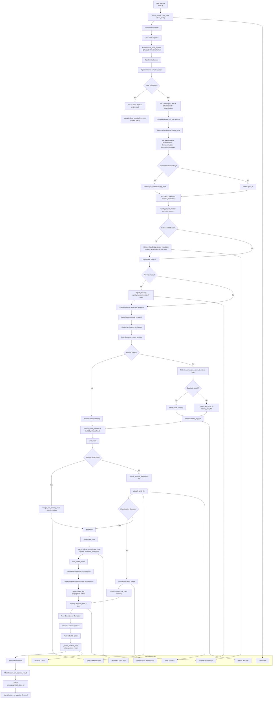

# Technical Pipeline

This document defines the active end-to-end execution pipeline in logically sequential order, from user trigger through persistence and UI refresh.

Canonical runtime path:

MainWindow -> PipelineWorker -> PipelineRunner -> PipelineWorkflow (workflow_engine.py) -> stage modules -> vault_manager -> graph build -> UI update.

## Stage 0: Launch and Bootstrap

Input:
- User starts app via python -m nestbrain.main or launcher/windows/start-nestbrain-desktop.vbs.

Process:
- nestbrain/main.py: main()
- get_resource_root()
- ensure_config() in nestbrain/core/pipeline_runner.py
- init_vault() in nestbrain/core/vault_manager.py
- load_config() in nestbrain/core/pipeline_runner.py
- MainWindow(app_root, config_path, config)

Output:
- Live Qt app with MainWindow and loaded PipelineConfig.

State Changes:
- Creates user-data config.json if missing.
- Creates vault root and vault README on first run.
- Persists vault_path and vault_initialized in config.

## Stage 1: Pipeline Trigger from UI

Input:
- User clicks pipeline start action in MainWindow.

Process:
- MainWindow._start_pipeline() in nestbrain/ui/main_window.py
- Creates QThread and PipelineWorker(app_root, run_config)
- Connects progress/status/result/error/finished signals
- Starts thread, invoking PipelineWorker.run()

Output:
- Background pipeline execution starts; UI remains responsive.

State Changes:
- In-memory UI state toggled to running.
- Selected collection key is passed into run config.

## Stage 2: Worker to Runner Handoff

Input:
- PipelineWorker.run() slot execution on worker thread.

Process:
- PipelineWorker.run() in nestbrain/workers/pipeline_worker.py
- Instantiates PipelineRunner(app_root)
- Calls PipelineRunner.run(config, progress_callback, status_callback)

Output:
- Synchronous runner result payload or structured worker error payload.

State Changes:
- Emits Qt signals only (progress/status/result/error/finished).

## Stage 3: Runner Validation and Service Initialization

Input:
- PipelineConfig from worker.

Process:
- PipelineRunner._run_async() in nestbrain/core/pipeline_runner.py
- _validate_vault_path(config.vault_path)
- Initializes ZoteroSyncClient(host, library_id, api_key)
- Initializes OllamaClient(host, api_key)
- Initializes KnowledgeGraphBuilder
- Delegates to self.workflow.run_full_pipeline(...)

Output:
- Prepared service clients and validated vault path; workflow invoked.

State Changes:
- Writes/reads temporary vault write probe during validation.
- Emits status/progress callbacks.

## Stage 4: Workflow Initialization

Input:
- vault_path, zotero client, ollama client, selected_collection_key.

Process:
- PipelineWorkflow.run_full_pipeline() in nestbrain/core/workflow_engine.py
- MarkdownNoteParser(vault_path).parse_vault()
- Initializes NoteSeeder, VectorIndexer, SemanticAuditor, ConnectionAnnotator
- Syncs Zotero via sync_all() or sync_collections_by_keys()
- Checks nvidia_client.is_configured() and records warning if missing

Output:
- Parsed note baseline plus synced collection list.

State Changes:
- Loads existing .nestbrain_index.json via VectorIndexer.
- Maintains warnings in workflow result payload.

## Stage 5: Per-Collection Registry Hydration

Input:
- One ZoteroCollection instance.

Process:
- PipelineWorkflow.process_collection(collection, vault_path, status_callback)
- collection_slug = collection.slug or to_slug(collection.display_name)
- PipelineRegistry.get_or_create(collection_slug, collection_display_name)
- get_new_sources(collection_slug, all_keys)

Output:
- Registry entry, new_source_keys, and new_items delta set.

State Changes:
- Creates new registry entry when collection has no existing state.

## Stage 6: Notebook Provisioning

Input:
- collection_slug and collection_display_name.

Process:
- notebook_id = registry.get_notebook_id(collection_slug)
- If missing: NotebookLMBridge.create_notebook(collection_display_name)
- registry.set_notebook_id(collection_slug, notebook_id)
- registry.save()

Output:
- NotebookLM notebook_id available for collection.

State Changes:
- Persists notebook_id into pipeline-registry.json.

## Stage 7: Source Ingestion

Input:
- new_items list and notebook_id.

Process:
- For each new item:
- Builds source_content from title, abstract, optional URL
- NotebookLMBridge.ingest_text(notebook_id, title, source_content)
- Collects successful_keys
- registry.mark_processed(collection_slug, successful_keys)
- registry.save()

Output:
- Notebook updated with new sources; successful key list.

State Changes:
- Updates processed_sources and last_updated in pipeline-registry.json.
- If none ingested, warning is appended to workflow warnings.

## Stage 8: Layer 1 Question Planning

Input:
- collection display name and context_summary from source items.

Process:
- _build_context_summary(new_items or all_items)
- QuestionPlanner.generate_taxonomy(subject, context_summary)

Output:
- taxonomy list of research questions.

State Changes:
- QuestionPlanner.used_fallback and last_error updated when model call fails.
- Warning appended when fallback used.

## Stage 9: Layer 1 Iterative Q&A Loop

Input:
- notebook_id and taxonomy.

Process:
- QAndALoop.execute_research(notebook_id, taxonomy)
- _ask_notebooklm_with_retry() with low-signal detection
- _evaluate_follow_ups() and deterministic recovery follow-ups
- _build_coverage_questions() if needed

Output:
- qa_history list containing base and follow-up Q&A entries.

State Changes:
- No direct file persistence in this stage.

## Stage 10: Layer 1 Master Synthesis

Input:
- subject title and qa_history.

Process:
- MasterSynthesizer.synthesize(subject, qa_history)
- _ensure_required_structure() repairs sparse model output
- If synth fails in workflow: _build_structured_deep_dive() fallback in PipelineWorkflow

Output:
- master_note_content and deep_dive_content.

State Changes:
- MasterSynthesizer.used_fallback and last_error may be set.

## Stage 11: Layer 2 Entity Extraction and Dedupe

Input:
- master_note_content.

Process:
- EntityExtractor.extract_entities(master_note_content)
- Confidence gate at >= 0.75
- PipelineWorkflow._dedupe_entities(entities)
- NoteSeeder.reset_link_overrides()

Output:
- deduped entity list for seeding/patching.

State Changes:
- EntityExtractor.last_scored_entities updated.
- Warning added when extraction fallback used or no entities found.

## Stage 12: Layer 2 Entity Note Create or Merge

Input:
- term, deep_dive_content, collection_display_name.

Process:
- NoteSeeder.process_extracted_term(term, master_note_context, subject_title)
- _scan_existing_notes_index()
- _semantic_duplicate_check(term, existing_notes)
- Branch A merge: merge_note(existing_path, master_note_context, subject_title)
- Branch B create: _seed_new_note() -> classify_and_file()
- _append_seeder_log() for merge/create/failed
- link_overrides updated for wikilink target correction

Output:
- last_result action and note_path/title metadata.

State Changes:
- Writes/updates Markdown note files in vault.
- Appends seeder_log.json entries.
- Adds aliases into frontmatter when needed.
- classify_and_file moves seed note into taxonomy destination.

## Stage 13: Inline Link Weaving and Synthesis Payload Assembly

Input:
- deep_dive_content, entities, alias map.

Process:
- MasterSynthesizer.weave_inline_wikilinks(content, entities, alias_map)
- Build SynthesisResult payload in PipelineWorkflow with:
- academic_synthesis
- conceptual_deep_dive
- actionable_knowledge
- knowledge_connections
- critical_evaluation
- glossary

Output:
- SynthesisResult object for final note writing.

State Changes:
- No direct file write in this stage.

## Stage 14: Collection Note Writing and Filing

Input:
- collection_slug, collection_display_name, item dicts, synthesis payload, media_paths, vault_path.

Process:
- write_note() in nestbrain/core/stages/notewriter_stage.py
- Branch A existing note path: merge_into_existing_note() then atomic replace
- Branch B new note: render_master_note() -> temporary file -> classify_and_file()
- On classification failure: log_classification_failure()

Output:
- note_path relative to vault (or empty string on classification failure).

State Changes:
- Creates/updates collection note file in vault.
- classify_and_file appends classification footer.
- classify_and_file appends vault_log.jsonl entry.
- classification_failures.jsonl appended on failure paths.

## Stage 15: Layer 3 Propagation for Related Notes

Input:
- new note title/path/content and vault_path.

Process:
- PipelineWorkflow._propagate_note()
- VectorIndexer.embed_new_note(note_title, note_content)
- VectorIndexer.find_similar_notes(new_vec, top_k=5)
- SemanticAuditor.audit_connections(note_content, matches)
- ConnectionAnnotator.annotate_connections(note_title, note_content, related_targets)

Output:
- Related-note annotations appended where relevant.

State Changes:
- Updates .nestbrain_index.json embedding map.
- Appends propagation sections in related notes.
- Appends propagation audit rows into vault_log.jsonl through append_vault_log_entry().

## Stage 16: Collection Completion Persistence

Input:
- collection_slug and note_path.

Process:
- registry.set_note_path(collection_slug, note_path)
- registry.save()

Output:
- Registry points collection to final filed note path.

State Changes:
- Updates note_path in pipeline-registry.json.

## Stage 17: Workflow Return to Runner

Input:
- Notes baseline, collections list, created_notes list, warnings/errors.

Process:
- PipelineWorkflow.run_full_pipeline() returns payload dict.

Output:
- workflow_result consumed by PipelineRunner.

State Changes:
- No direct writes in this stage.

## Stage 18: Graph Build and Archive Write

Input:
- workflow_result payload.

Process:
- PipelineRunner._coerce_notes() and _coerce_collections()
- KnowledgeGraphBuilder.build(notes, collections, semantic_links)
- PipelineRunner._create_archive_entry(...)
- audit_unclassified_notes(config.vault_path)

Output:
- final runner payload:
- notes
- collections
- graph
- archive_entry
- classification_audit
- created_notes
- errors

State Changes:
- Writes run_YYYYMMDD_HHMMSS.json into user-data runs directory.

## Stage 19: UI Result and Error Handling

Input:
- Worker emits result payload or error payload.

Process:
- MainWindow._on_pipeline_result(payload)
- Updates workspace note list, graph view, vault overview
- Updates pipeline panel collections and connection state
- Triggers GraphWorker for additional graph refresh when notes/collections exist
- MainWindow._on_pipeline_error(payload) shows error dialog
- MainWindow._on_pipeline_finished() sets running false and 100% progress

Output:
- User sees updated notes, graph, and status.

State Changes:
- In-memory UI state for progress, collection cache, and graph display updated.

## Stage 20: Post-Run Artifacts and Review Surface

Input:
- Completed run and updated filesystem state.

Process:
- Operator can inspect:
- user-data runs/*.json archive files
- pipeline-registry.json
- vault_log.jsonl
- seeder_log.json
- classification_failures.jsonl
- .nestbrain_index.json

Output:
- Auditable trace of execution, filing, and propagation.

State Changes:
- None beyond persisted files already written in prior stages.

## Legacy Surface (Report Only)

These modules exist in-tree but are not in active PipelineRunner -> workflow_engine execution:

- nestbrain/core/workflow.py
- nestbrain/core/stages/notebooklm_stage.py
- nestbrain/core/stages/synthesis_stage.py
- nestbrain/core/nvidia_nim_client.py
- scripts/notebooklm_operations.py

## Mermaid Blueprint

